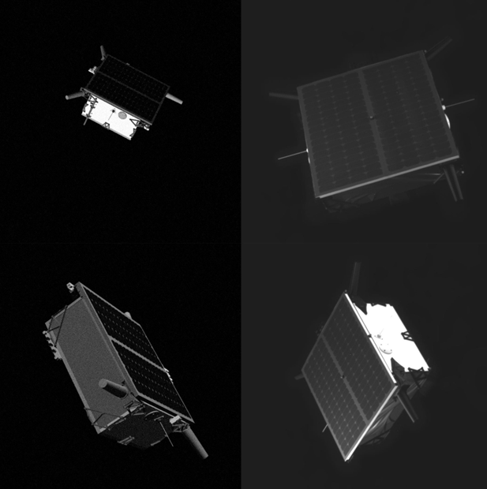
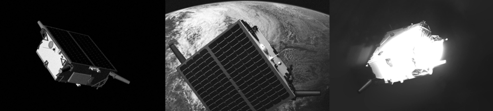
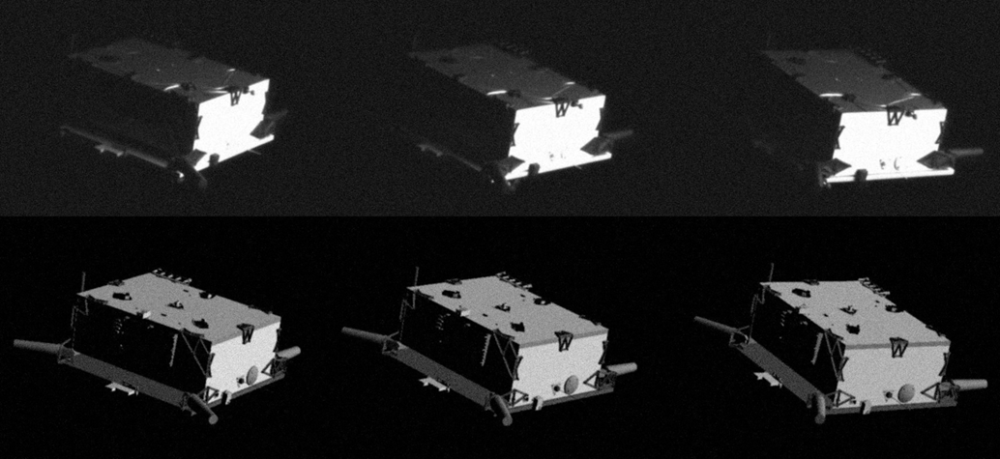

Vision-Based Navigation Datasets Compilation
======

In this post I would like to share a compilation of existing datasets for relative Pose Estimation of spacecraft. In the space-industry this technology commonly falls under the umbrella of *Vision-Based Navigation*. 

I wanted to centralize this information because today the datasets are scattered all over academic papers and university or agency websites. I want to save other researchers from having to go through the work I had to do to finda all these.

Most of these are publically available but some (especially the in-space ones) are still confidential unfortunately. Let this post serve as a reminder to make these public also to the greater researcher community.  

Datasets
======

SPEED
------
Dataset created at the TRON facility of Stanford’s Space Rendezvous Laboratory (SLAB). It was used for the 1st Pose Estimation Competition in 2019 jointly organized by ESA’s Advanced Concepts Team and SLAB. It contains laboratory and synthetic images of the TANGO satellite.

Download link: [Spacecraft Pose Estimation Dataset (SPEED) | Stanford Digital Repository](https://purl.stanford.edu/dz692fn7184)

Literature link: [Satellite Pose Estimation Challenge: Dataset, Competition Design and Results](https://arxiv.org/abs/1911.02050)

|  | 
|:--:| 
| Example of SPEED images: synthetic (left) and robotic testbed (right) |

SPEED+
------

Dataset created at the TRON facility of Stanford’s Space Rendezvous Laboratory (SLAB). It represents an extension of the SPEED dataset and should be preferred as it offers considerably more and better data. It was used for the 2nd Pose Estimation Competition  in 2021 jointly organized by ESA’s Advanced Concepts Team and SLAB.

It contrast to SPEED which does not have ground truth for the robotic testbed images SPEED+ does contain labelled laboratory images. Additionally, it contains many more robotic testbed images (9531 compared to 300). The robotic testbed images are available in two different lighting conditions, with albedo lightbox (including earth added in background in postprocessing) and with a sunlamp (light source might be visible in images).

Download link: [Next Generation Spacecraft Pose Estimation Dataset (SPEED+) | Stanford Digital Repository](https://purl.stanford.edu/wv398fc4383)

Literature link: [SPEED+: Next-Generation Dataset for Spacecraft Pose Estimation across Domain Gap](https://arxiv.org/abs/2110.03101)

|  |
|:--:| 
| Synthetic (left), robotic testbed: lightbox (middle), sunlamp (right) |

SHIRT
------

This dataset represents another extension of the SPEED dataset, once again created at the TRON facility of SLAB. Its goal is to provide a baseline for a full Vision Based Navigation Filter and thus includes synthetic and laboratory images along two representative trajectories (approach and station keeping). 

Download link: [SHIRT: Satellite Hardware-In-the-loop Rendezvous Trajectories Dataset | Stanford Digital Repository](https://purl.stanford.edu/zq716br5462)
Literature link: [Adaptive Neural Network-based Unscented Kalman Filter for Robust Pose Tracking of Noncooperative Spacecraft](https://arxiv.org/abs/2206.03796)

|  |
|:--:| 
| Example of SHIRT dataset: along trajectory, synthetic (bottom), robotic testbed (top) |

